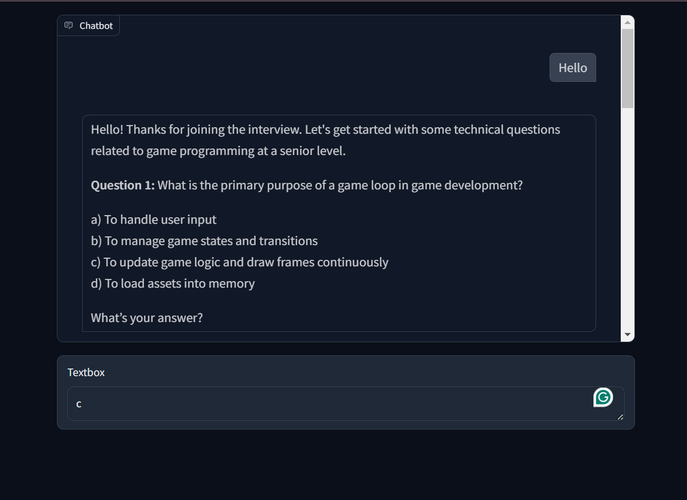

# Game Development Interview Chatbot

This project is a simple chatbot that asks interview questions for a game development role. It is built using Python, OpenAI, and Gradio. There is also a console version that can be found in app_console.py.

## Features

- Asks interview questions specific to game development.
- Provides multiple-choice answers and checks if the user's answer is correct.
- Continues with new questions after each answer.

## Requirements

- Python 3.7+
- OpenAI API key

## Installation

1. Create a virtual environment:

    ```bash
    python -m venv venv
    source venv/bin/activate   # On Windows, use `venv\Scripts\activate`
    ```

2. Install the dependencies:

    ```bash
    pip install -r requirements.txt
    ```

3. Set up your OpenAI API key:

    Create a `.env` file in the root directory of the project and add your OpenAI API key:

    ```plaintext
    OPEN_AI_API_KEY=your_openai_api_key
    ```

## Running the Project

1. Start the Gradio interface:

    ```bash
    python app_web.py
    ```

2. Open your web browser and navigate to the URL provided by Gradio (usually `http://127.0.0.1:7860`).

## Usage

- Interact with the chatbot through the web interface.
- The chatbot will ask interview questions and provide multiple-choice answers.
- Select an answer and the chatbot will tell you if it is correct or not, then move on to the next question.

## Example



## Dependencies

- Python 3.7+
- OpenAI
- Gradio
